<h1>docker-web-management</h1>

A website to control your Docker containers, images...

# Set-up
1. ## **Install Node.JS and NPM:**
## Installation on Linux
* *Update your libraries.*
```sh
sudo apt-get update
```
* *Install Node.JS:*
```sh
sudo apt install nodejs
```
* *Verify the installation:*
```sh
node -v
```
* *Install npm:*
```sh
sudo apt install npm
```
* *Verify the installation:*
```sh
npm -v
```

## Installation on Windows/MacOS
* *Download Node.JS from their [webpage](https://nodejs.org/en/download/)*

2. ## **Download Docker:**
You can do this from the [Docker Website](https://docs.docker.com/get-docker/)

3. ## **Clone this repository:**
```sh
git clone https://github.com/Tatuck docker-web-management.git

cd docker-web-management
cd src
```
3. ## **(Optional) Change the WebSocket server port from the [config file](/config.json).**

4. ## **Install the dependencies:**
```sh
npm install
```
---
# How to use
```sh
node index
```
# Common problems:
## Permission denied:
```
Error: listen EACCES: permission denied 0.0.0.0:80
```
`https://www.digitalocean.com/community/tutorials/how-to-use-pm2-to-setup-a-node-js-production-environment-on-an-ubuntu-vps#give-safe-user-permission-to-use-port-80`
```sh
sudo apt-get install libcap2-bin

sudo setcap cap_net_bind_service=+ep `readlink -f \`which node\`` 
```
## Address already in use
```
Error: listen EADDRINUSE: address already in use
```
You can find out which process is using a port with this command: <br>
(linux)
```sh
sudo lsof -i -P -n
```

# What can this program do?
* Show your containers
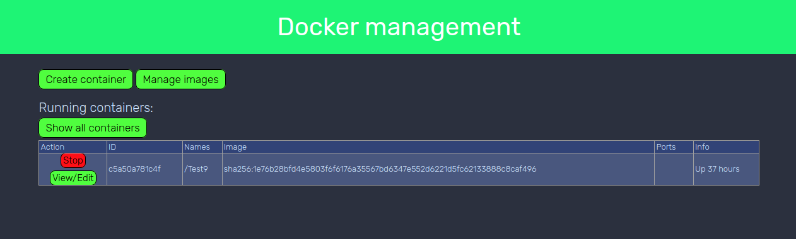
* Edit your containers
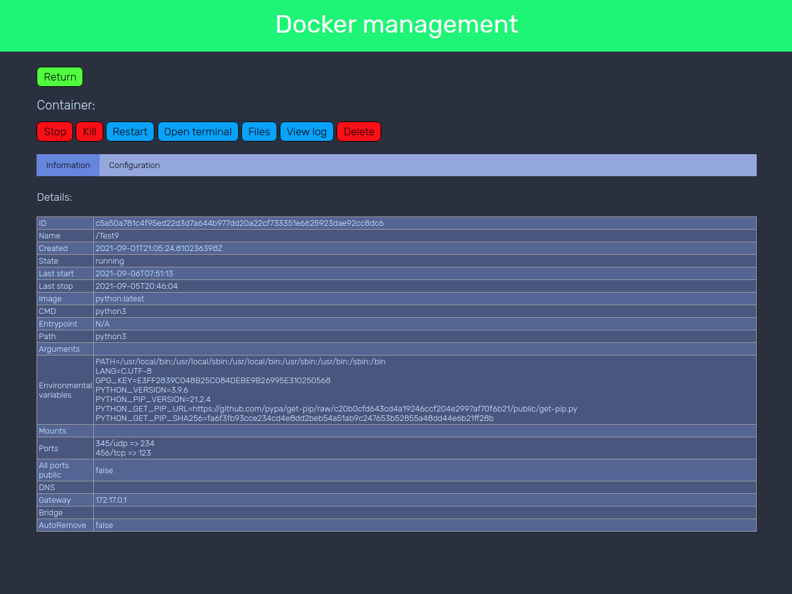
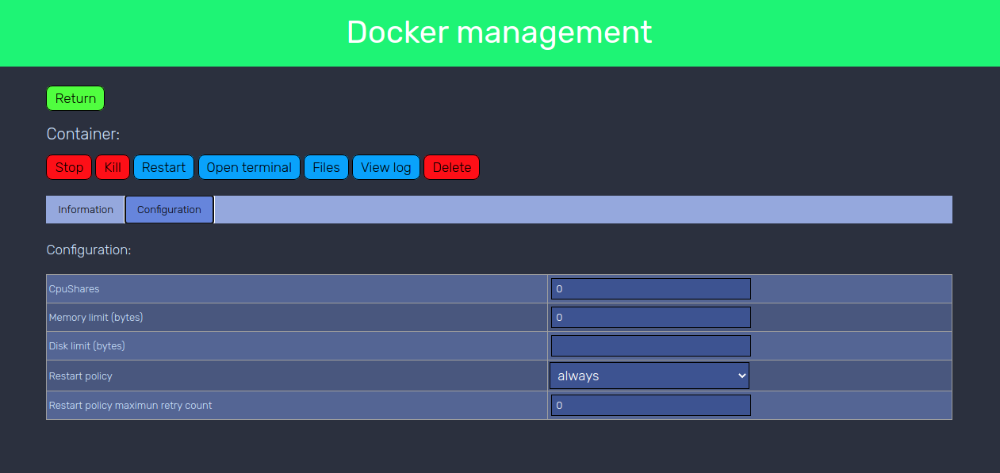
* Enter a terminal of a container
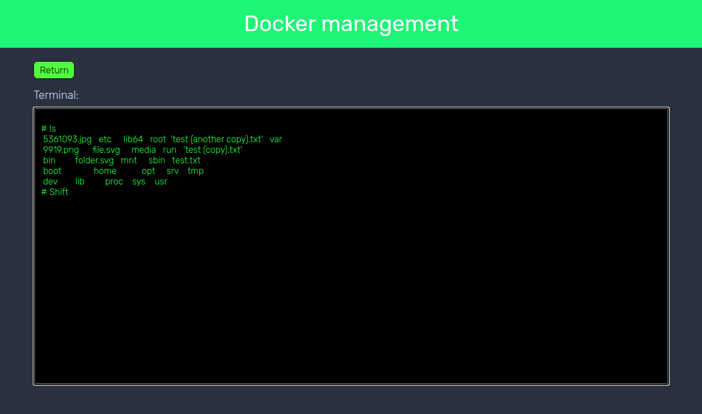
* View the logs of a container
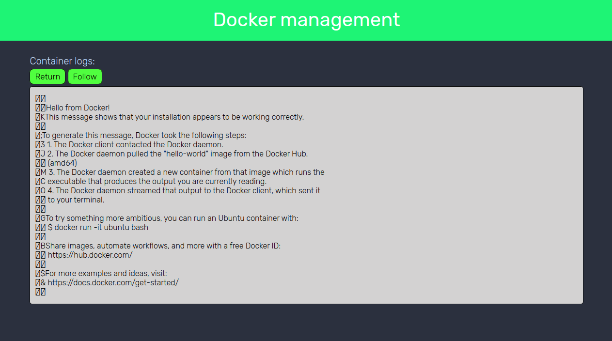
* View the files of a container
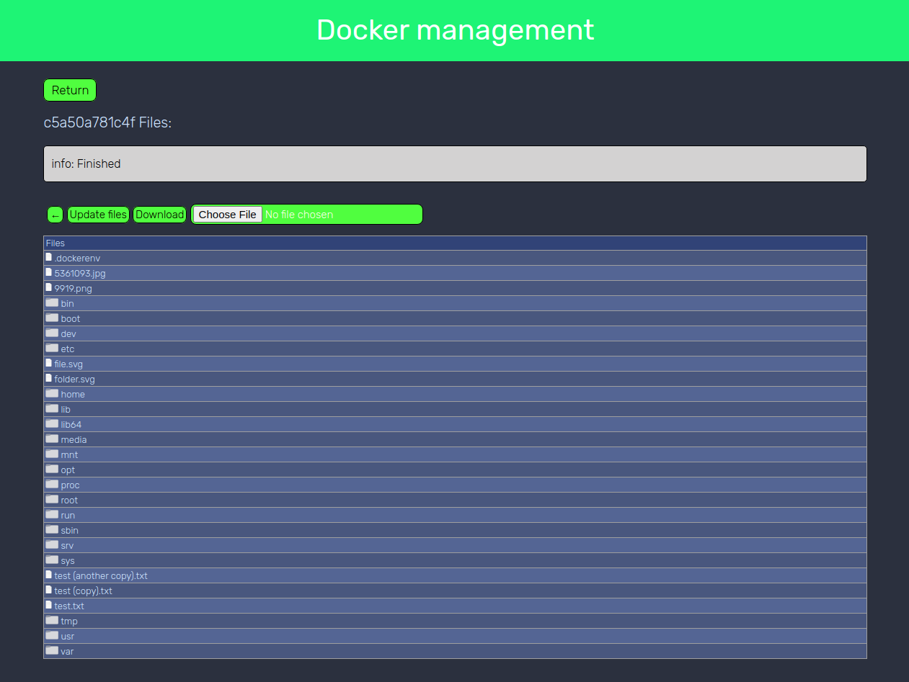
* Create a new container
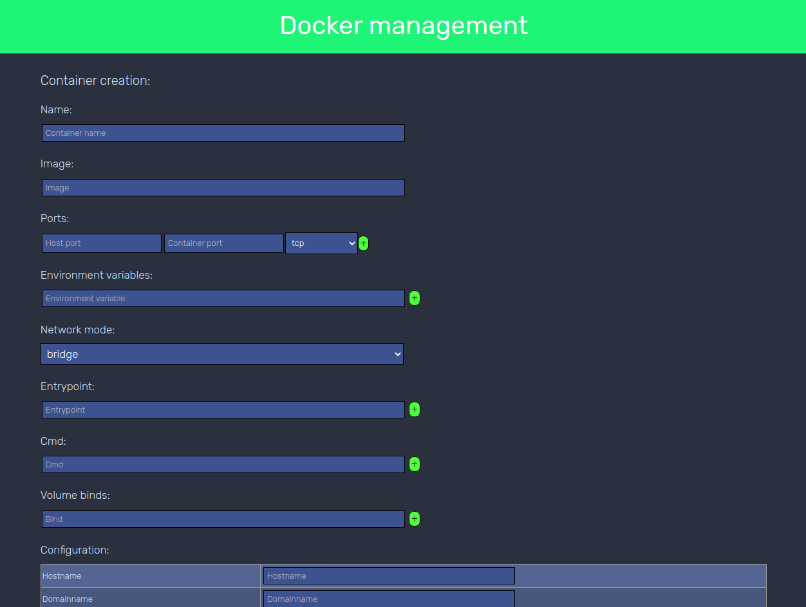
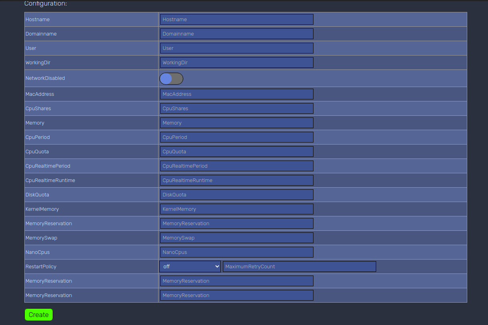
* Show your images
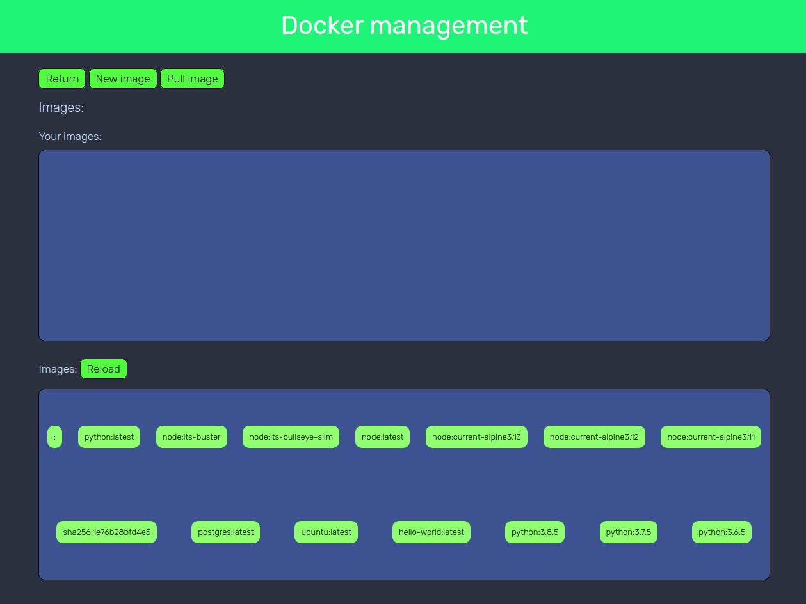
* View any image
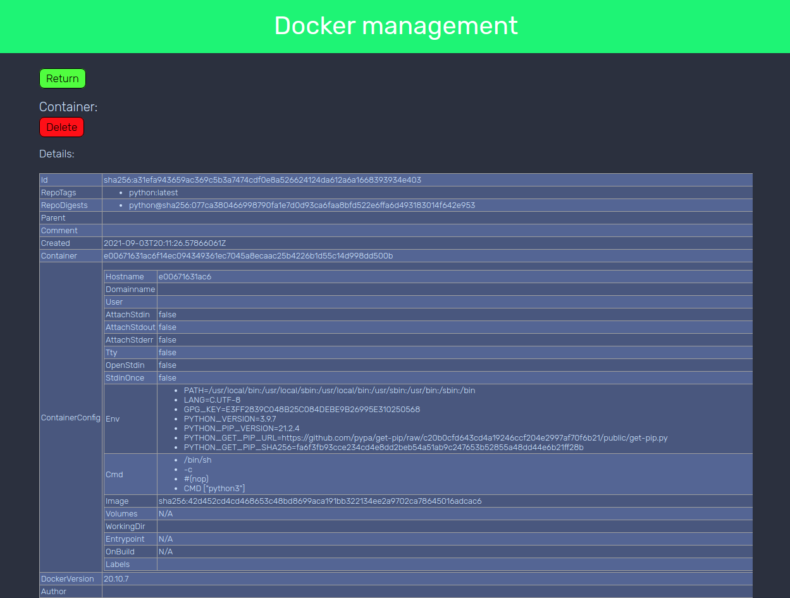
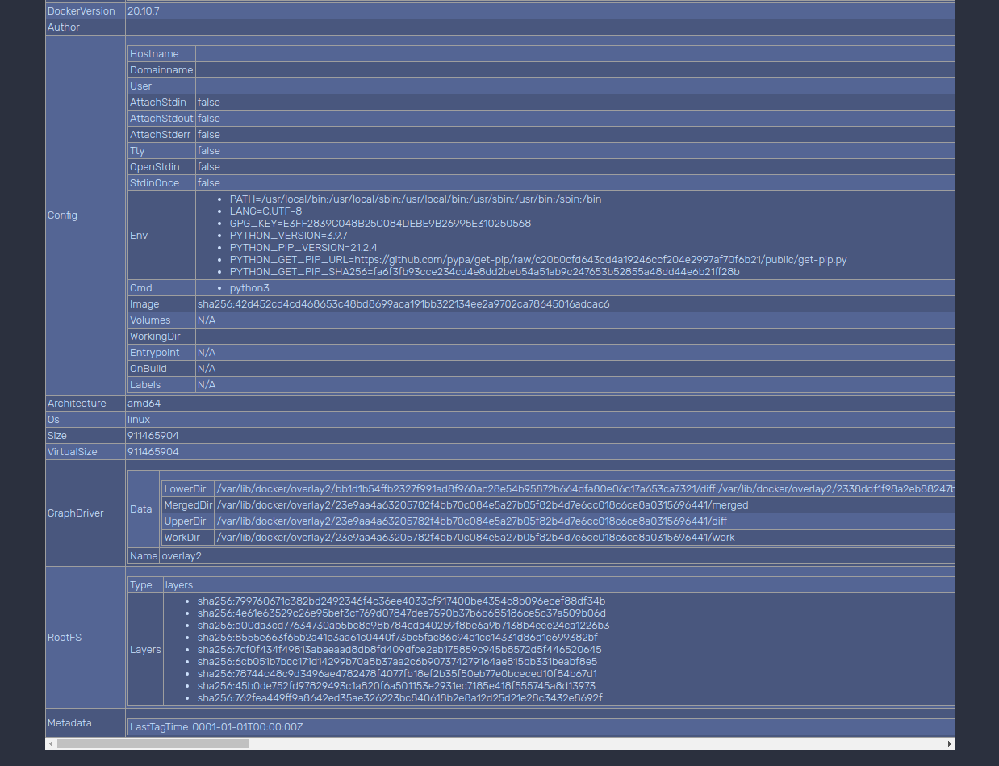
* Create a new image
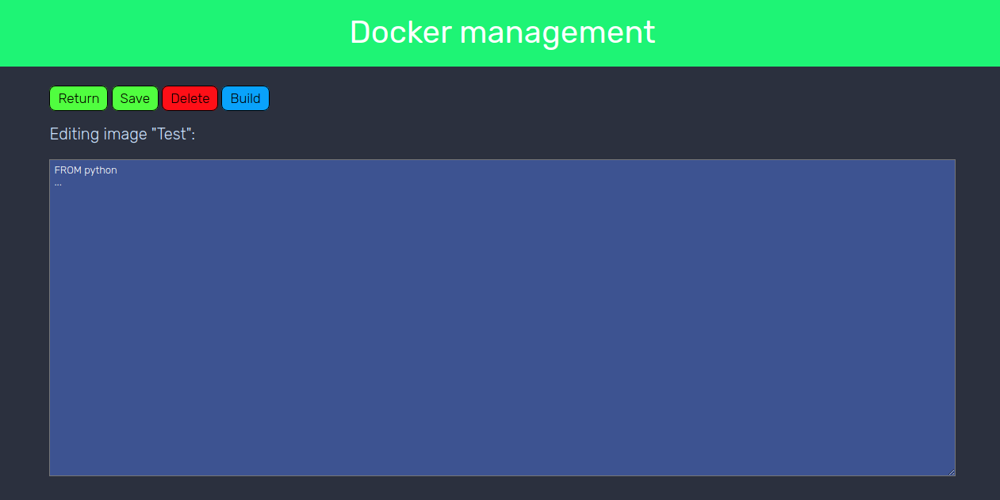
* Pull an image
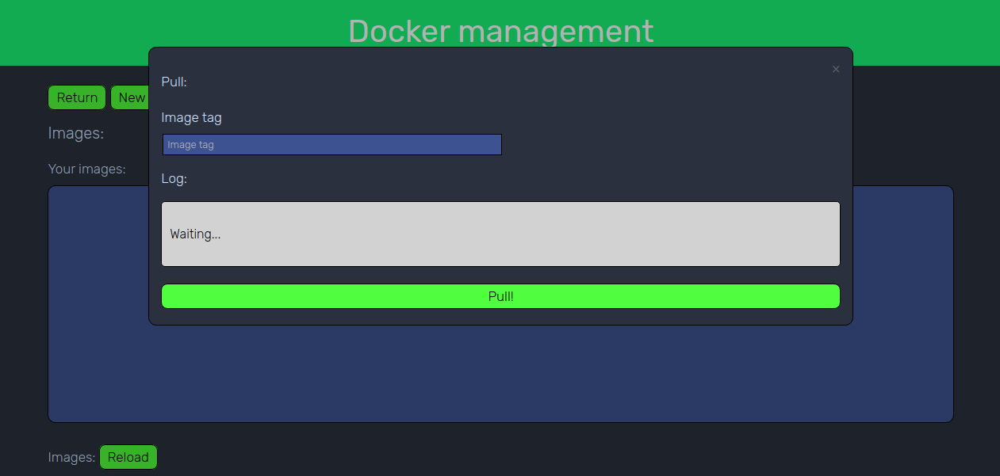


# How can I help?
You can help making pull requests, issues or contacting the developers.

# Credits:
*Big thanks to:*
* [dockerode](https://github.com/apocas/dockerode)
* [rimraf](https://github.com/isaacs/rimraf)
* [tar-fs](https://github.com/mafintosh/tar-fs)
* [multer](https://github.com/expressjs/multer)
* [expressjs](https://github.com/expressjs/express)